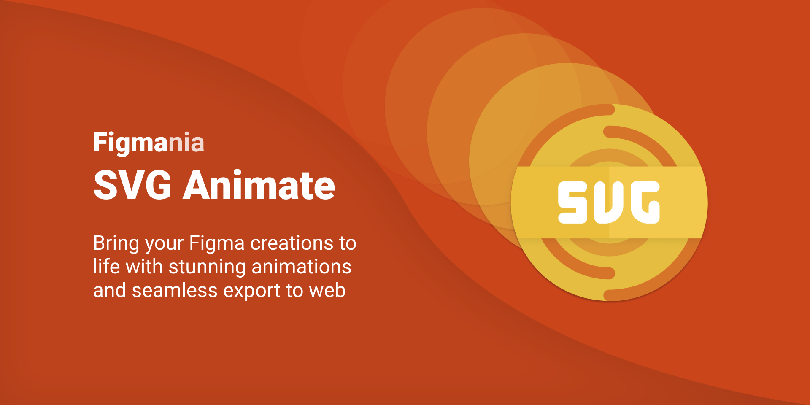

## Figmania SVG Animate

> Bring your Figma creations to life with stunning animations and seamless export to web.

## What it is

SVG Animate allows you to create stunning animations with ease. No need for complicated workarounds and going deep into the code. Instead, you can create animations individually on every element of your Figma creation by using a simple but powerful animation editor.

## Installation

Install directly from the [Figma Plugin Page](https://www.figma.com/community/plugin/980366185319754464/SVG-Animate)

## How it create SVG Animations:

1. Select the Frame you want to animate and click on Enable SVG Export.
2. Select a node within that Frame to set up animations such as X Position, Y Position, Scale, Rotation and Opacity.
3. Use the built-in live-preview to tweak your animations until you're happy with the result.
4. Download or copy the animated SVG and paste it on your website.

## How to use SVG Animations on my Website:

* SVG Animate uses a small web component library under the hood to make your animations work.
* This library uses GreenSock GSAP, a powerful, lightweight and performant animation engine.
* When exporting from SVG Animate, you can download or copy the snippet with the click of a button, and paste it on your website. No complicated setup needed.

## License

MIT
